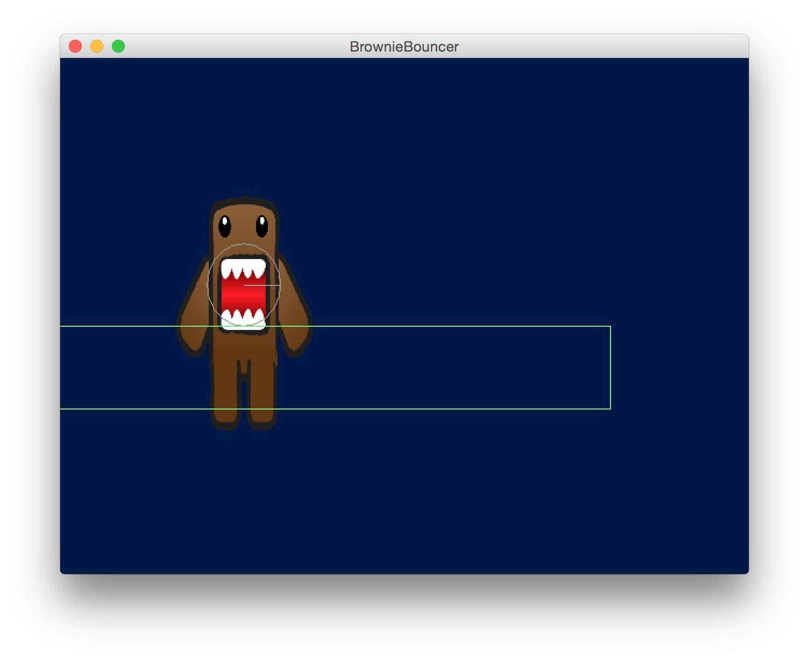
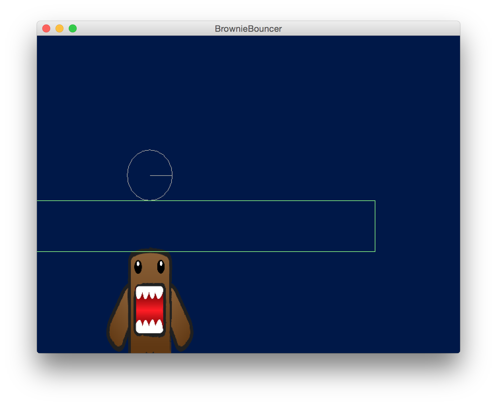

##Repro for Box2D issue

###Description of Issue
I have a physics system that is running the World.step and updating the entity's TransformComponent based on the BodyComponent's body.getPosition(). I have a RenderingSystem that builds the camera, and translates from world to Pixel units. The rendering is working fine. I have a PhysicsDebugSystem that creates a Box2DDebugRenderer. It is working fine.

What is not working, is that the position of my test body (a DynamicBody Circle) appears to ALWAYS move with gravity, even though the debug renderer clearly shows the body has stopped when it collides with a static body.

I have an AnimationComponent on the dynamic body, which is rendered based on the position, so you can see in the screenshots below, the body stops for the debugrenderer, but the position continues to decrement on Y based on gravity so the animation falls along with it.

###Screenshots

